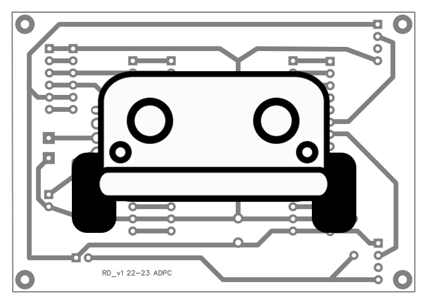

<a name="readme-top"></a>

<!-- PROJECT LOGO -->
<br />
<div align="center">
    
  </a>

  <h3 align="center">Development of a didactic robot</h3>

  <p align="center">
  The project aims at the development of a didactic robot capable of performing movements in 2D space. The ultimate goal is to create a prototype that has a set of interconnected sensors and actuators. 
    <br />
    <br />
    <a href="https://github.com/AlexFigas/Projeto-Robot-Didatico/issues">Report Issue</a>
  </p>
</div>

<p align="right">(<a href="#readme-top">back to top</a>)</p>

<!-- TABLE OF CONTENTS -->
<details>
  <summary>Table of Contents</summary>
  <ol>
    <li>
      <a href="#about-the-project">About The Project</a>
    </li>
    <li>
      <a href="#getting-started">Getting Started</a>
      <ul>
        <li><a href="#installation">Installation</a></li>
      </ul>
    </li>
    <li><a href="#report">Report</a></li>
    <li><a href="#license">License</a></li>
    <li><a href="#contact">Contact</a></li>
    <li><a href="#acknowledgments">Acknowledgments</a></li>
  </ol>
</details>

<p align="right">(<a href="#readme-top">back to top</a>)</p>

<!-- ABOUT THE PROJECT -->
## About The Project

The project presented in this report describes the development of an educational robot capable of performing movements in 2D space. The developed prototype consists of a set of interconnected sensors and actuators. Furthermore, the robot allows communication with a computer/mobile device through Bluetooth communication.

This project aims to create an educational environment for exploring concepts related to robotics, such as motion control, wireless communication, and Java programming. The developed prototype is a functional educational robot that can be used as a learning tool.

<p align="right">(<a href="#readme-top">back to top</a>)</p>

<!-- GETTING STARTED -->
## Getting Started

To get started with this project you must have some sort of Arduino development environment, wich must be able to upload code threw Serial.

<p align="right">(<a href="#readme-top">back to top</a>)</p>

### Installation

1. Install some kind of Arduino development environment, in our case we use Arduino IDE, VS Code and Arduino extension:
* https://www.arduino.cc/en/software
* https://code.visualstudio.com/
    * https://marketplace.visualstudio.com/items?itemName=vsciot-vscode.vscode-arduino

2. Install the required Arduino boards and Libraries:
* https://randomnerdtutorials.com/installing-the-esp32-board-in-arduino-ide-windows-instructions/ 
* https://github.com/adafruit/Adafruit-PWM-Servo-Driver-Library

3. Clone the repo and add it to the Arduino IDE libraries.
    ```sh
    git clone https://github.com/AlexFigas/Projeto-Robot-Didatico.git
    ```
4. Enjoy!

<p align="right">(<a href="#readme-top">back to top</a>)</p>

<!-- REPORT -->
## Report

Herein lies the final report of the project in Portuguese.

* [Download the report here](docs/report.pdf)

<p align="right">(<a href="#readme-top">back to top</a>)</p>

<!-- LICENSE -->
## License

Distributed under the  GPL-3.0 License. See `LICENSE` for more information.

<p align="right">(<a href="#readme-top">back to top</a>)</p>

<!-- CONTACT -->
## Contact

Alexandre Figueiredo - [Linkedin](https://www.linkedin.com/in/alexfigas/) - [Email](mailto:alexfigas11@gmail.com)

Daniela Gonçalves - [Linkedin](https://www.linkedin.com/in/danielafilipagoncalves/) - [Email](mailto:danielagoncalves2000@hotmail.com)

<p align="right">(<a href="#readme-top">back to top</a>)</p>

<!-- ACKNOWLEDGMENTS -->
## Acknowledgments

We would like to express our sincere gratitude to all the individuals who contributed to the successful completion of this final undergraduate project. In particular, we would like to thank:

Our advisors, Dr. Carlos Gonçalves and Dr. Pedro Matutino, for their constant support, guidance, and valuable suggestions throughout the entire process. Their availability was crucial for the development of this work.

We couldn't fail to express our gratitude to the friends we made during our academic journey in this class. We appreciate your willingness to always help, share knowledge, and be an essential part of our personal and professional growth.

Furthermore, we would like to thank each other for our partnership in this group project. Collaboration, open communication, and teamwork were key factors in the success of this project.

Finally, we would like to thank our family members and loved ones for their unconditional support, understanding, and patience throughout the entire duration of this project. Your encouraging words and motivation were essential in maintaining our drive.

Sincerely,\
Alexandre Figueiredo\
Daniela Gonçalves
